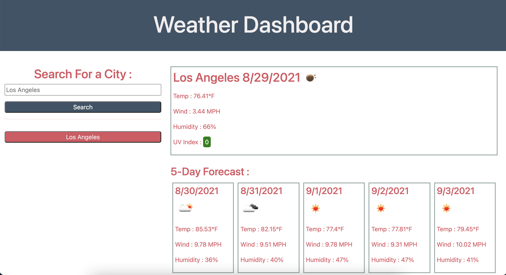

# weather-dashboard

## A Weather Dashboard Where User Can Save City Searches &amp; See Current Weather As Well As A 5-Day Forecast

## User Story

As a user traveling to different cities, I want to check the current weather as well as a 5-day forecast so I may plan my trip accordingly.

## Features

Using the Weather Dashboard app, users can search for cities & find the current weather as well as a 5-Day Foreceast. Their searches will save to the page so they can simply access them at a later time, even upon page reload & browser shutdown.  
 
Upon searching for a city, users are presented with a weather icon, temperature, wind speed, humidity, & UV Index for the current day as well as for the next 5 days. 
 
The use of emojis is a visually appealing way for the user to connect to the weather conditions & the dynamic color pertaining to the severity of the UV Index is another way users can interpret the information visually. 
 
The page has been styled with accessiblity in mind - the color scheme was chosen to satisy a large range of audiences.

## Table of Contents
  - [Installation](#installation)
  - [Languages](#languages-and-technologies-used)
  - [Questions](#questions)
  - [Contributors](#contributors)
  - [License](#license)
  - [Author](#author-notes)
  - [Screenshots](#application-screenshots)

## Installation

### Deployed Application

You may visit the deployed application HERE : https://lyndseyjw.github.io/weather-dashboard/

### Clone Repository

Git clone git@github.com:lyndseyjw/weather-dashboard.git

### Start Application

Open app in default browser to view.

## Languages and Technologies Used

HTML5, Advanced CSS, JQuery, API Fetch

## Questions

You may visit my Github at : https://github.com/lyndseyjw OR email lyndseyjwatson@gmail.com if you have any questions.

## Contributors

Lyndsey Watson

## License

This project is licensed under the terms of the MIT license.

## Author Notes

This was a fun challenge in dynamically manipulating the DOM via Javascript & a wonderful practice applying my backend skills using API fetch requests. I gained valuable experience analyzing data so I could traverse the objects & arrays returned from the requests in order to dispaly the desired content on the webpage. Users can search for current & future weather in cities anywhere in the world. The UI responds to their searches & is aware of the current date, allowing for a variety of responses based on timezone. 

Creating dynamic websites such as this is a great way to incentivize users to continue returning as the webpage appears to be tailored solely for them. All of their search histories are shown on the page & will be there when they return, even after quitting the screen. They can always return to their previous searches & see all of the cities they had previously searched.

## Application Screenshot

